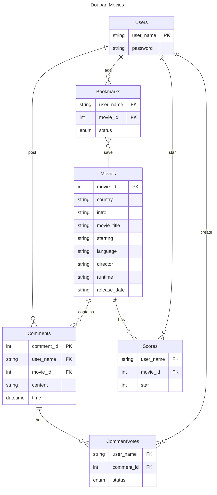

# COMP2013J Group 8 Project Report

## System Description

The information system implemented in the project is **A Movie Review Information System** modeled after [Douban](https://movie.douban.com/top250), which includes scores and reviews for the top 250 movies. Users can <u>sign up</u> and <u>log in</u> with an account to access the system, where they can <u>favorite</u>, <u>rate</u>, and <u>write comments</u> for the movies.

The project uses **a front-end and back-end separation architecture**, with the back-end designed using ***RESTful APIs*** and the front-end using ***AJAX*** to asynchronously retrieve and display data on the page. Additionally, the project's database uses **MySQL** and has been **deployed on a server**, allowing for access to the data from anywhere via the internet.

## Technology Stack Selection

- **Front-end**
  - ***React.js*** --> The library for web and native user interfaces.
  - ***Next.js*** --> The React framework to create full-stack web application.
- **Back-end**
  - ***Javalin*** --> A web micro framework for Java to create RESTful APIs.
- **Database**
  - ***MySQL***

> **The reasons why we give up using JSP:**
>
> 1. The coupling of front-end and back-end code and logic makes development and maintenance difficult.
> 2. JSP cannot be used with popular front-end frameworks nowadays.
> 3. It is difficult to implement asynchronous logic in JSP.

## System Architecture

The system architecture is mainly composed of four parts: **the client, the webpage, the backend server, and the database server.** The client accesses the webpage through a browser and interacts with it. The webpage exchanges data with the backend server through the HTTP protocol, and the backend server exchanges data information with the database server. The data information is then sent to the webpage, which renders new content and displays it on the client.


## Tasks

### ER Diagram and Relation Model

> The primary key of Bookmarks, Scores, and CommentVotes is a composite primary key consisting of two foreign keys.



### SQL Statement

#### Movies

```sql
CREATE TABLE `movies` (
  `movie_id` BIGINT PRIMARY KEY,
  `country` VARCHAR(255),
  `intro` TEXT,
  `movie_title` VARCHAR(255),
  `starring` VARCHAR(255),
  `language` VARCHAR(255),
  `directedBy` VARCHAR(255),
  `runtime` VARCHAR(255),
  `release_date` VARCHAR(255),
  `genre` VARCHAR(255),
  `img_url` VARCHAR(255),
  `abstract` VARCHAR(255)
);
```

#### Users

```sql
CREATE TABLE users (
  user_name VARCHAR(255) PRIMARY KEY,
  `password` VARCHAR(255) NOT NULL
);
```

#### Bookmarks

```sql
CREATE TABLE bookmarks (
  user_name VARCHAR(255) NOT NULL,
  movie_id BIGINT NOT NULL,
  status ENUM('WANNA', 'WATCHED') NOT NULL,
  FOREIGN KEY (user_name) REFERENCES users(user_name) ON DELETE CASCADE ON UPDATE CASCADE,
  FOREIGN KEY (movie_id) REFERENCES movies(movie_id) ON DELETE CASCADE ON UPDATE CASCADE,
  PRIMARY KEY (user_name, movie_id)
);
```

#### Comments

```sql
CREATE TABLE comments (
  comment_id int AUTO_INCREMENT PRIMARY KEY,
  user_name VARCHAR(255) NOT NULL,
  movie_id BIGINT NOT NULL,
  content TEXT NOT NULL,
  time DATETIME NOT NULL,
  FOREIGN KEY (user_name) REFERENCES users(user_name) ON DELETE CASCADE ON UPDATE CASCADE,
  FOREIGN KEY (movie_id) REFERENCES movies(movie_id) ON DELETE CASCADE ON UPDATE CASCADE
);
```

#### CommentVotes

```sql
CREATE TABLE commentvotes (
  user_name VARCHAR(255) NOT NULL,
  comment_id int NOT NULL,
  status ENUM('UP', 'DOWN') NOT NULL,
  FOREIGN KEY (user_name) REFERENCES users(user_name) ON DELETE CASCADE ON UPDATE CASCADE,
  FOREIGN KEY (comment_id) REFERENCES comments(comment_id) ON DELETE CASCADE ON UPDATE CASCADE,
  PRIMARY KEY (user_name, comment_id)
);
```

#### Scores

```sql
CREATE TABLE scores (
  user_name VARCHAR(255) NOT NULL,
  movie_id BIGINT NOT NULL,
  score int NOT NULL,
  FOREIGN KEY (user_name) REFERENCES users(user_name) ON DELETE CASCADE ON UPDATE CASCADE,
  FOREIGN KEY (movie_id) REFERENCES movies(movie_id) ON DELETE CASCADE ON UPDATE CASCADE,
  PRIMARY KEY (user_name, movie_id)
);
```

### Backend Service - API Documentation

| HTTP Verbs | Endpoints                                         | Action                                   | Response Format |
| ---------- | ------------------------------------------------- | ---------------------------------------- | --------------- |
| GET        | /api/movies/{id}                                  | To retrieve movie by id in the db        | JSON            |
| GET        | /api/movies?page={page}&limit={limit}             | To get movies by page and limit          | JSON            |
| GET        | /api/movies/count                                 | To get total number of movies in the db  | JSON            |
| POST       | /api/users                                        | Create an user in the db                 | JSON            |
| POST       | /api/users/login                                  | Login Authentication                     | JSON            |
| GET        | /api/users                                        | To get all user names in the db          | JSON            |
| GET        | /api/bookmarks/{userName}                         | To get the bookmarks by user name        | JSON            |
| POST       | /api/bookmakrs/{userName}/{movieId}/{status}      | Create a bookmark                        | JSON            |
| PUT        | /api/bookmarks/{userName}/{movieId}/{status}      | Update a bookmark                        | JSON            |
| DELETE     | /api/bookmarks/{userName}/{movieId}               | Delete a bookmark                        | JSON            |
| GET        | /api/scores/{movieId}                             | To get all the score records by movie id | JSON            |
| POST       | /api/scores/{userName}/{movieId}/{score}          | Create a score record                    | JSON            |
| PUT        | /api/scores/{userName}/{movieId}/{score}          | Update a score record                    | JSON            |
| DELETE     | /api/scores/{userName}/{movieId}                  | Delete a score record                    | JSON            |
| GET        | /api/comments/{commentId}                         | Get a comments by id                     | JSON            |
| GET        | /api/comments/movie/{movieId}                     | Get all the comments of a movie          | JSON            |
| POST       | /api/comments                                     | Create a comment                         | JSON            |
| DELETE     | /api/comments/{commentId}                         | Delete a comment                         | JSON            |
| GET        | /api/commentvotes/{commentId}                     | Get all comment votes by id              | JSON            |
| POST       | /api/commentvotes/{userName}/{commentId}/{status} | Create a comment vote                    | JSON            |
| PUT        | /api/commentvotes/{userName}/{commentId}/{status} | Update a comment vote                    | JSON            |
| DELETE     | /api/commentvotes/{userName}/{commentId}          | Delete a comment vote                    | JSON            |

### Frontend Website

```TEXT
Route (app)                                Size     First Load JS     Functions
┌ ○ /                                      4.75 kB         122 kB			Show movies by page
├ ○ /bookmark                              3.72 kB         121 kB			Show user's bookmarks
├ ○ /login                                 1.25 kB         138 kB			The login page
├ λ /movie/[id]                            3.7 kB          123 kB			Show movie information, score, and comments
└ ○ /signup                                1.25 kB         138 kB			The signup page
```

## Feature Demonstration

### Root Page

1. The links for **login and signup**.
2. The **movie** information card.
3. The **bookmark** buttons to add the movie to bookmarks.


1. The **pagination** allows users to change pages.


### Signup

1. The **form** for users to input their username and password.
2. A **warning message** appears when the inputted username **already exists** in the database.
3. The **submit button** is disabled when the username is already taken or when both the username and password fields are blank.
4. A **link** to the login page is provided.


### Login

1. The **form** for users to input their username and password.
2. The **submit button** is disabled when the username and password fields are blank.
3. A **link** to the signup page is provided.


1. A **warning message** appears when the user name or password is incorrect.


### Add Bookmarks

1. The button to add the movie to the **Wanna Watch** bookmarks.
2. The button to add the movie to the **Watched** bookmarks.
3. The **link** to the bookmarks page.
4. The button to **log out**.


### Bookmarks Page

1. The list to display movies marked as "**Want to Watch**".
2. The list to display movies marked as "**Watched**".
3. The button to add the movie to the "Want to Watch" bookmarks.
4. The button to add the movie to the "Watched" bookmarks.

> It is valid to **change the bookmark type on this page**, and the list will automatically update to reflect the change.


### Movie Page

1. Movie **information**.
2. The **average score** of the movie calculated by all users' scores.
3. The button to set the **bookmark**.
4. The component allowing users to **score the movie**.
5. Movie **introduction**.
6. Comment **text area**.
7. The **submit button**, disabled when the comment is blank.
8. The buttons to choose the **order of comments**, by popularity or time.
9. The **comment**.
10. The buttons to **vote a comment** as useful or useless.


## Team Member Contribution

- **Jiawen Chen**
  - Implement Movies APIs.
  - Design and create Movies table.
  - Scraping movies data from the Internet.
  - Design front-end UI.
  - Design the functionality of the website.
  - Record a demonstration  video.

- **Shaorou Tang**
  - Implement Comments APIs.
  - Design and create Comments table.
  - Implement CommentVotes APIs.
  - Design and create CommentVotes table.
  - Design the functionality of the website.
  - Record a demonstration video.

- **Xinran Liu**
  - Implement Bookmarks APIs.
  - Design and create Bookmarks table.
  - Implement Scores APIs.
  - Design and create Scores table.
  - Design the functionality of the website.
  - Record a demonstration video.

- **Yang Qiu**
  - Implement Users APIs.
  - Design and create Users table.
  - Create front-end website.
  - Record a demonstration video.


## Self Assessing


## Project Timeline

