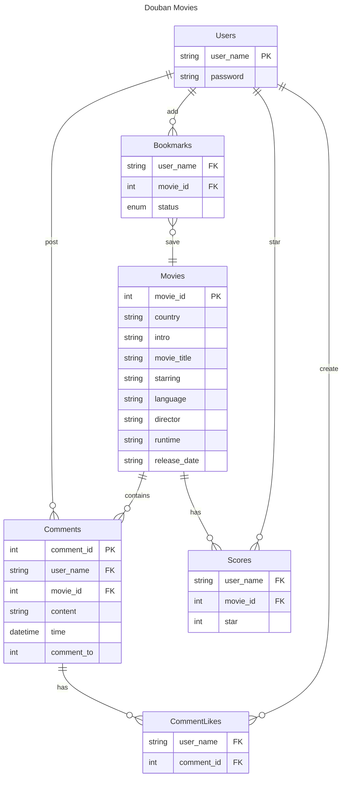

# COMP2013J Douban Project Server

<p align="center">
  
</p>

## Configure Commit Lint Hook

```shell
$ chmod ug+x .githooks/*
$ git config core.hooksPath .githooks
```

[🌈Conventional Commits😋](https://www.conventionalcommits.org/en/v1.0.0/)

## Entities Relationship Diagram



## API Documentation

| HTTP Verbs | Endpoints                                    | Action                                   | Response Format |
| ---------- | -------------------------------------------- | ---------------------------------------- | --------------- |
| GET        | /api/test                                    | To get top 10 movies in the db           | JSON            |
| GET        | /api/movies/{id}                             | To retrieve movie by id in the db        | JSON            |
| GET        | /api/movies?page={page}&limit={limit}        | To get movies by page and limit          | JSON            |
| GET        | /api/movies/count                            | To get total number of movies in the db  | JSON            |
| POST       | /api/users                                   | Create an user in the db                 | JSON            |
| POST       | /api/users/login                             | Login Authentication                     | JSON            |
| GET        | /api/users                                   | To get all user names in the db          | JSON            |
| GET        | /api/bookmarks/{userName}                    | To get the bookmarks by user name        | JSON            |
| POST       | /api/bookmakrs/{userName}/{movieId}/{status} | Create a bookmark                        | JSON            |
| PUT        | /api/bookmarks/{userName}/{movieId}/{status} | Update a bookmark                        | JSON            |
| DELETE     | /api/bookmarks/{userName}/{movieId}          | Delete a bookmark                        | JSON            |
| GET        | /api/scores/{movieId}                        | To get all the score records by movie id | JSON            |
| POST       | /api/scores/{userName}/{movieId}/{score}     | Create a score record                    | JSON            |
| PUT        | /api/scores/{userName}/{movieId}/{score}     | Update a score record                    | JSON            |
| DELETE     | /api/scores/{userName}/{movieId}             | Delete a score record                    | JSON            |

