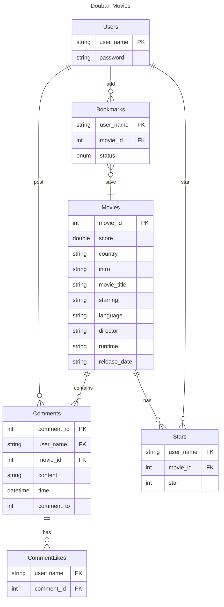

# COMP2013J Douban Project Server

<p align="center">
  
</p>

## Configure Commit Lint Hook

```shell
$ chmod ug+x .githooks/*
$ git config core.hooksPath .githooks
```

[🌈Conventional Commits😋](https://www.conventionalcommits.org/en/v1.0.0/)

## Entities Relationship Diagram



## API Documentation

| HTTP Verbs | Endpoints                     | Action                             | Response Format |
| ---------- | ----------------------------- | ---------------------------------- | --------------- |
| GET        | /api/test                     | To get top 10 movies in the db.    | JSON            |

